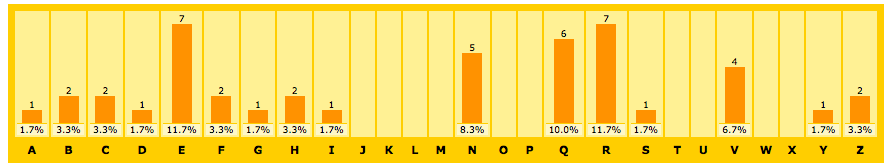

# Desafio de Segurança

## DESCRIÇÃO

---

Cada vez mais os processos seletivos estão utilizando resolução de problemas para analisar o nível de compreensão dos conceitos de programação do candidato. Para simular esse processo será exigido a entrega de no **mínimo dois** dos algoritmos de segurança descritos a seguir.

Detalhe, as questões já possuem esboços disponíveis em arquivos dependendo da linguagem. Para maiores detalhes veja a **seção CÓDIGO**.

### QUESTÕES

---

**QUESTÃO 1** - Na área da segurança da informação existe um ramo chamado de [Análise de Criptografia](https://en.wikipedia.org/wiki/Cryptanalysis), que consiste em uma séria de técnicas que podem ser utilizadas para desvendar uma mensagem criptografada.

Segundo o portal [Cryptool](http://cryptool-online.de/index.php?option=com_content&view=article&id=55&Itemid=53&lang=en) existe algumas estratégias que podem ser utilizadas para analisar uma mensagem criptografada. Na maioria das vezes, o esforço e complexidade das técnicas vai depender da criptografia utilizada. Por exemplo, no filme [O Jogo da Imitação](https://pt.wikipedia.org/wiki/O_Jogo_da_Imitação) é possível ver o quão complexo foi para o matemático Alan Turing decodificar a máquina Enigma, usada pela Alemanha Nazista para tornar suas mensagens incompreensíveis em caso de interceptação pelo inimigo.

Contudo, existem criptografias mais simples que podem ser decodificados com técnicas mais fáceis. Para ilustrar, considere a Análise de Criptografia de Cifra de César através da seguinte mensagem:

> Dhny é n áeiber cersrevqn qr hz nqzvavfgenqbe qr erqrf? Vcê.

O próprio padrão da análise de frequências das letras já pode indicar que existe a possibilidade de uso de algum algoritmo de substituição, como a Cifra de César, mas ao se observar a mensagem não fica claro apontar qual foi a substituição específica.

Dentre as criptografias de substituição existe o rotacionamento, uma forma de decodificar a mensagem nessa criptografia poderia ser tentando "rotacionar" a mensagem de **ROT1** até **ROT25**, para que visualmente se identifique a legibilidade de alguma mensagem, ou seja, no caso de recebermos a mensagem `Dhny é n áeiber cersrevqn qr hz nqzvavfgenqbe qr erqrf? Vcê.` poderíamos aplicar os seguintes rotacionamentos com os respectivos resultados:

| Rotacionamentos | Resultado                                                      |
| --------------- | -------------------------------------------------------------- |
| `rot1`          | `ioz é o áfjcfs dfstsfwro rs ia orawbwghforcf rs fsrsg? Wdê.`  |
| `rot2`          | `jpa é p ágkdgt egtutgxsp st jb psbxcxhigpsdg st gtsth? Xeê.`  |
| `rot3`          | `kqb é q áhlehu fhuvuhytq tu kc qtcydyijhqteh tu hutui? Yfê.`  |
| `rot4`          | `lrc é r áimfiv givwvizur uv ld rudzezjkirufi uv ivuvj? Zgê.`  |
| `rot5`          | `msd é s ájngjw hjwxwjavs vw me sveafakljsvgj vw jwvwk? Ahê.`  |
| `rot6`          | `nte é t ákohkx ikxyxkbwt wx nf twfbgblmktwhk wx kxwxl? Biê.`  |
| `rot7`          | `ouf é u álpily jlyzylcxu xy og uxgchcmnluxil xy lyxym? Cjê.`  |
| `rot8`          | `pvg é v ámqjmz kmzazmdyv yz ph vyhdidnomvyjm yz mzyzn? Dkê.`  |
| `rot9`          | `qwh é w ánrkna lnabanezw za qi wziejeopnwzkn za nazao? Elê.`  |
| `rot10`         | `Nrxi é x áoslob mobcbofax ab rj xajfkfpqoxalo ab obabp? Fmê.` |
| `rot11`         | `Osyj é y áptmpc npcdcpgby bc sk ybkglgqrpybmp bc pcbcq? Gnê.` |
| `rot12`         | `Ptzk é z áqunqd oqdedqhcz cd tl zclhmhrsqzcnq cd qdcdr? Hoê.` |
| `rot13`         | `Qual é a árvore preferida de um administrador de redes? Ipê.` |
| `rot14`         | `Rvbm é b áswpsf qsfgfsjeb ef vn benjojtusbeps ef sfeft? Jqê.` |
| `rot15`         | `Swcn é c átxqtg rtghgtkfc fg wo cfokpkuvtcfqt fg tgfgu? Krê.` |
| `rot16`         | `Txdo é d áuyruh suhihulgd gh xp dgplqlvwudgru gh uhghv? Lsê.` |
| `rot17`         | `Uyep é e ávzsvi tvijivmhe hi yq ehqmrmwxvehsv hi vihiw? Mtê.` |
| `rot18`         | `Vzfq é f áwatwj uwjkjwnif ij zr firnsnxywfitw ij wjijx? Nuê.` |
| `rot19`         | `Wagr é g áxbuxk vxklkxojg jk as gjsotoyzxgjux jk xkjky? Ovê.` |
| `rot20`         | `Xbhs é h áycvyl wylmlypkh kl bt hktpupzayhkvy kl ylklz? Pwê.` |
| `rot21`         | `Ycit é i ázdwzm xzmnmzqli lm cu iluqvqabzilwz lm zmlma? Qxê.` |
| `rot22`         | `Zdju é j áaexan yanonarmj mn dv jmvrwrbcajmxa mn anmnb? Ryê.` |
| `rot23`         | `Aekv é k ábfybo zbopobsnk no ew knwsxscdbknyb no bonoc? Szê.` |
| `rot24`         | `Bflw é l ácgzcp acpqpctol op fx loxtytdeclozc op cpopd? Taê.` |
| `rot25`         | `Cgmx é m ádhadq bdqrqdupm pq gy mpyuzuefdmpad pq dqpqe? Ubê.` |

Veja agora que fica viável analisar a mensagem criptografada, pois ela está legível no [**ROT13**](http://www.rot13.com) que desvenda a mensagem `Qual é a árvore preferida de um administrador de redes? Ipê.`

Um fato interessante, se 13 rotações foram usadas para compreender a mensagem original, significa que foi usado um **ROT13** para criptografar a mensagem original, pois `ROT13` para criptar mais `ROT13` para decriptar deve resultar em `26`.

Por tanto, crie um programa que ao receber uma mensagem crifada seja gerado os rotacionamento de **ROT1** até **ROT25**.

**QUESTÃO 2** - A [Análise de Frequência](https://en.wikipedia.org/wiki/Frequency_analysis) é uma ferramenta importante na Análise de Criptografia. Sua essência consiste em uma simples análise de quantas letras existem em uma mensagem.

Essa ferramenta pode ser importante na Análise de Criptografia porque a frequência das letras em um idioma possui um certo padrão, por exemplo, segundo o portal [Cryptool](http://cryptool-online.de/index.php?option=com_content&view=article&id=96&Itemid=117&lang=en) a letra de mais alta frequência no inglês é o `e` seguido do `t`, com frequências aproximadas de 12,7% e 9,1% respectivamente.

Tal informação pode ser útil nos algoritmos de substituição, pois a identificação da frequência na mensagem cifrada pode sugerir como foi realizada a substituição, ou seja, se na mensagem criptografada, escrito originalmente em inglês, a palavra de maior frequência for `h`, isso pode indicar que o **ROT3** foi usado, que seria a distância de `e` para `h`.

Visualmente a análise de frequência da seguinte mensagem:

> Dhny é n áeiber cersrevqn qr hz nqzvavfgenqbe qr erqrf? Vcê.

Pode ser gerada usando ferramentas como o [counton.org](http://www.counton.org/explorer/codebreaking/frequency-analysis.php) que graficamente exibe a frequência na _Figura 2.1_:

_Figura 2.1 - Análise de Frequência._<br>
<br>
(Fonte: [counton.org](http://www.counton.org/explorer/codebreaking/frequency-analysis.php))

Então, crie um programa que ao receber uma mensagem, como `Dhny é n áeiber cersrevqn qr hz nqzvavfgenqbe qr erqrf? Vcê.` retorne a frequência de cada caractere por meio dessa estrutura:

| Frequência | Caracteres                                            |
| ---------- | ----------------------------------------------------- |
| `1`        | `.`, `?`, `a`, `d`, `g`, `i`, `s`, `y`, `á`, `é`, `ê` |
| `2`        | `b`, `c`, `f`, `h`, `z`                               |
| `4`        | `v`                                                   |
| `5`        | `n`                                                   |
| `6`        | `q`                                                   |
| `7`        | `e`, `r`                                              |
| `10`       | ``                                                    |

**QUESTÃO 3** - Na Análise de Criptografia, o termo [Password cracking](https://en.wikipedia.org/wiki/Password_cracking) se refere às técnicas utilizadas para desvendar a senha original, e dependendo da criptografia existem formas específicas de se atacá-las, usando desde técnicas de forças bruta ou engenharia social.

Até um certo tempo, era muito comum encontrar senhas sendo mascaradas por [Funções Hash](https://en.wikipedia.org/wiki/Cryptographic_hash_function), mas devido a técnicas como o [Rainbow Table](https://en.wikipedia.org/wiki/Rainbow_table) isso já não é mais recomendado.

Por exemplo, se você utilizar o [Hash MD5](https://en.wikipedia.org/wiki/MD5) para criptografar a mensagem `senhasecreta` o resultado será `7ddd68e771c61f836eb6de453185c505`:

```
$ md5 -s 'senhasecreta'
MD5 ("senhasecreta") = 7ddd68e771c61f836eb6de453185c505
```

Pela teoria as funções Hashs são irreversíveis, ou seja, de `7ddd68e771c61f836eb6de453185c505` não é possível saber que veio de `senhasecreta`, entretanto, é possível gerar uma tabela que várias combinações de caracteres para saber qual é o seu respectivo Hash, ou seja, o que chamamos de Rainbow Table.

| Senhas de `lenght` 2\* | MD5\*\*                          |
| ---------------------- | -------------------------------- |
| a                      | 0cc175b9c0f1b6a831c399e269772661 |
| b                      | 92eb5ffee6ae2fec3ad71c777531578f |
| ...                    | ...                              |
| zy                     | 4345ed1bd9c52c31610be7c0080981c3 |
| zz                     | 25ed1bcb423b0b7200f485fc5ff71c8e |

_(\*) Para gerar todas as combinações de palavras com tamanho `x` use as funções disponíveis no arquivo da questão._<br>
_(\*\*) Para gerar o MD5 use `md5('senha')`._

Por isso que hoje é fácil encontrar ferramentas como o [crackstation](https://crackstation.net) que já permitem desvendar algumas senhas curtas com as principais funções Hashs.

Mas por uma questão de autonomia, vamos criar a classe `RainbowTable` para quebrar senhas MD5 de tamanho máximo de `x`. Então, considerando as combinações de tamanho `2` o hash md5 `534b9a3588bdd87bf7c3b9d650e43e46` foi gerado pela messagem `pu`.

## CÓDIGO

---

Veja esta relação de código inicial e alternativa de resposta disponíveis nestas linguagens:

| Linguagem  | Código inicial           | Alternativa de Resposta                    |
| ---------- | ------------------------ | ------------------------------------------ |
| Javascript | [code.zip](js/code.zip)  | [code-response.zip](js/code-response.zip)  |
| PHP        | [code.zip](php/code.zip) | [code-response.zip](php/code-response.zip) |
| Python     |                          |                                            |

Já para facilitar o mapeamento das questões com o código inicial veja esta outra relação:

| Questão | Javascript            | PHP                       | Python |
| ------- | --------------------- | ------------------------- | ------ |
| 1       | `code/cipher`         | `code/src/Chiper/`        |        |
| 2       | `code/word-frequency` | `code/src/WordFrequency/` |        |
| 3       | `code/rainbow-table`  | `code/src/RainbowTable/`  |        |
