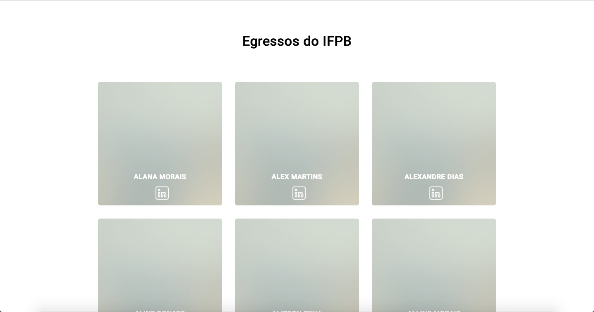

# Interface Web para o IFPB-ALUMNI

## DESCRIÇÃO

---

O IFPB possui uma demanda que consiste em rastrear o percurso profissional de seus alunos. Para isto, foi idealizado a construção de um portal que exibisse um conjunto de cards de alunos contendo algumas de suas informações, como o linkedin, github, facebook, etc. A ideia seria criar uma interface Web renderizado no backend com PHP baseado na página [https://ifpb.github.io/egressos/](https://ifpb.github.io/egressos/), conforme ilustra a _Figura 1_.

_Figura 1 - Layout Web do [https://ifpb.github.io/egressos/](https://ifpb.github.io/egressos/)_

Para a construção desta página será necessário atender alguns requisitos:

- Crie o ambiente de execução da aplicação Web usando o `docker-compose.yml`;
- Crie uma base de dados para persistir a informação dos alunos. (Dica: use a biblioteca PDO para manipular o banco de dados MySQL);
- Crie um mecanismo de autenticação para restringir o acesso da página dos egressos. (Dica: utilize um tabela de usuários para garantir o acesso à página).
