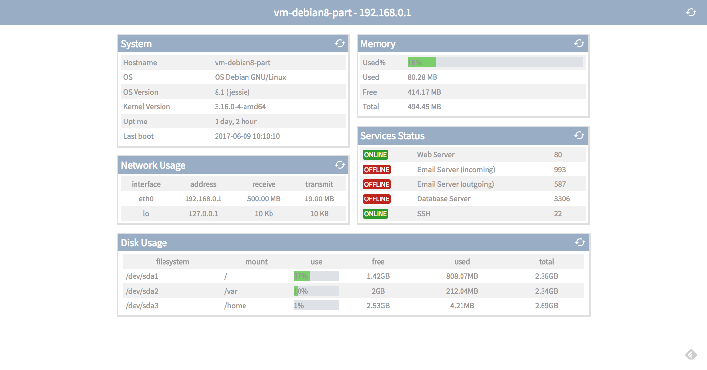

# EZ Server Monitor

## DESCRIÇÃO
---

Considere que a empresa eZ Server Monitor, graças ao sucesso dos profissional no IFPB para gerar o Front-End, veio em busca mais um profissional com domínio nos conceitos de adminstração de sistemas, que pudesse finalizar a criação da página Web de seu sistema [eSM Web](http://ezservermonitor.com/esm-web/features), corrompido devido a problemas de backup.

A princípio foi disponibilizado o Front-End do projeto no arquivo [code.zip](code.zip), contudo, ainda falta gerar no sistema os dados em tempo real, conforme à *Figura 1*, usando dados JSON do arquivo `v1/monitor.php` por meio da linguagem PHP.

*Figura 1 - Layout da página*



Portanto, cabe a você continuar o desenvolvimento através dos componentes que serão levantadas a seguir.

## COMPONENTES
---

No Layout da *Figura 1* é possível identificar que existem os painéis de informações do Host selecionado, contudo, todas as informações necessárias para a construção dessas ilustrações estarão disponibilizadas a seguir. Então, através do código obtido alimente os seguintes componentes:

**COMPONENTE 1** Painel de dados do sistema por meio da rota `/v1/monitor.php?info=system` que deve retorna o JSON:

```js
{
  "hostname": "vagrant-ubuntu-trusty-64",
  "os": "Ubuntu trusty",
  "osVersion": "14.04",
  "kernelVersion": "GNU/Linux 3.13.0-108-generic",
  "uptime": "1 hour, 10 minutes",
  "lastBoot": "Jul 13 00:36"
}
```

Os comandos utilizados para obter esses dados podem ser esses:

```
$ hostname
vagrant-ubuntu-trusty-64

$ lsb_release -i
Distributor ID: Ubuntu

$ lsb_release -c
Codename:       trusty

$ lsb_release -r
Release:        14.04

$ uname -o
GNU/Linux

$ uname -r
3.13.0-108-generic

$ uptime -p
up 15 hours, 9 minutes

$ who -b
system boot  2018-07-13 00:36
```

**COMPONENTE 2** Painel de dados das interfaces de rede por meio da rota `/v1/monitor.php?info=network` que deve retorna o JSON:

```js
[
  {
    "interface": "eth0",
    "address": "10.0.2.15",
    "receive": "143.6 KB",
    "transmit": "135.4 KB"
  },
  {
    "interface": "lo",
    "address": "127.0.0.1",
    "receive": "4.7 KB",
    "transmit": "4.7 KB"
  }
]
```

O comando utilizado para obter esses dados pode ser esse:

```
$ ifconfig -a
eth0      Link encap:Ethernet  HWaddr 08:00:27:62:8e:9b
          inet addr:10.0.2.15  Bcast:10.0.2.255  Mask:255.255.255.0
          inet6 addr: fe80::a00:27ff:fe62:8e9b/64 Scope:Link
          UP BROADCAST RUNNING MULTICAST  MTU:1500  Metric:1
          RX packets:1035 errors:0 dropped:0 overruns:0 frame:0
          TX packets:658 errors:0 dropped:0 overruns:0 carrier:0
          collisions:0 txqueuelen:1000
          RX bytes:89145 (89.1 KB)  TX bytes:76622 (76.6 KB)

lo        Link encap:Local Loopback
          inet addr:127.0.0.1  Mask:255.0.0.0
          inet6 addr: ::1/128 Scope:Host
          UP LOOPBACK RUNNING  MTU:65536  Metric:1
          RX packets:24 errors:0 dropped:0 overruns:0 frame:0
          TX packets:24 errors:0 dropped:0 overruns:0 carrier:0
          collisions:0 txqueuelen:0
          RX bytes:2370 (2.3 KB)  TX bytes:2370 (2.3 KB)
```

**COMPONENTE 3** Painel de dados das interfaces da memória por meio da rota `/v1/monitor.php?info=memory` que deve retorna o JSON:

```js
{
  "usedPercent": 0.23,
  "used":"302MB",
  "free":"187MB",
  "total":"489MB"
}
```

O comando utilizado para obter esses dados pode ser esse:

```
$ free
             total       used       free     shared    buffers     cached
Mem:        501692     301408     200284      19048      12788     126668
-/+ buffers/cache:     161952     339740
Swap:            0          0          0
```

**COMPONENTE 4** Painel de dados dos status dos serviços por meio da rota `/v1/monitor.php?info=service` que deve retorna o JSON:

```js
[
  {
    "status": "up",
    "service": "Web Server",
    "port": "80"
  },
  {
    "status": "down",
    "service": "Email Server (incoming)",
    "port": "993"
  },
  {
    "status": "down",
    "service": "Email Server (outgoing)",
    "port": "587"
  },
  {
    "status": "down",
    "service": "Database Server",
    "port": "3306"
  },
  {
    "status": "up",
    "service": "SSH",
    "port": "22"
  }
]
```

O comando utilizado para obter esses dados pode ser esse:

```
# service --status-all
 [ + ]  acpid
 [ + ]  apache2
 [ + ]  apparmor
 [ ? ]  apport
 [ + ]  atd
 [ + ]  chef-client
 [ ? ]  console-setup
 [ + ]  cron
 [ ? ]  cryptdisks
 [ ? ]  cryptdisks-early
 [ - ]  dbus
 [ ? ]  dns-clean
 [ + ]  friendly-recovery
 [ - ]  grub-common
 [ ? ]  irqbalance
 [ ? ]  killprocs
 [ ? ]  kmod
 [ - ]  landscape-client
 [ ? ]  mysql
 [ ? ]  networking
 [ ? ]  ondemand
 [ ? ]  open-vm-tools
 [ ? ]  pppd-dns
 [ - ]  procps
 [ + ]  puppet
 [ ? ]  rc.local
 [ + ]  resolvconf
 [ + ]  rpcbind
 [ - ]  rsync
 [ + ]  rsyslog
 [ ? ]  screen-cleanup
 [ ? ]  sendsigs
 [ + ]  ssh
 [ - ]  sudo
 [ + ]  udev
 [ ? ]  umountfs
 [ ? ]  umountnfs.sh
 [ ? ]  umountroot
 [ - ]  unattended-upgrades
 [ - ]  urandom
 [ - ]  virtualbox-guest-utils
 [ ? ]  virtualbox-guest-x11
 [ - ]  x11-common
```

**COMPONENTE 5** Painel de dados das partições por meio da rota `/v1/monitor.php?info=disk` que deve retorna o JSON:

```js
[
  {
    "filesystem": "/dev/sda1",
    "mount": "/",
    "use": "37",
    "free": "1.42GB",
    "used": "808.07MB",
    "total": "2.36GB"
  },
  {
    "filesystem": "/dev/sda2",
    "mount": "/var",
    "use": "10",
    "free": "2GB",
    "used": "212.04MB",
    "total": "2.34GB"
  },
  {
    "filesystem": "/dev/sda3",
    "mount": "/home",
    "use": "1",
    "free": "2.53GB",
    "used": "4.21MB",
    "total": "2.69GB"
  }
]
```

O comando utilizado para obter esses dados pode ser esse:

```
$ df -h | tail -n +2
udev            241M   12K  241M   1% /dev
tmpfs            49M  360K   49M   1% /run
/dev/sda1        40G  1.7G   37G   5% /
none            4.0K     0  4.0K   0% /sys/fs/cgroup
none            5.0M     0  5.0M   0% /run/lock
none            245M     0  245M   0% /run/shm
none            100M     0  100M   0% /run/user
none            113G   97G   17G  86% /var/www/html/php
```

<br>
<br>

> Alternativa de resposta: [code-response/](code-response/)
