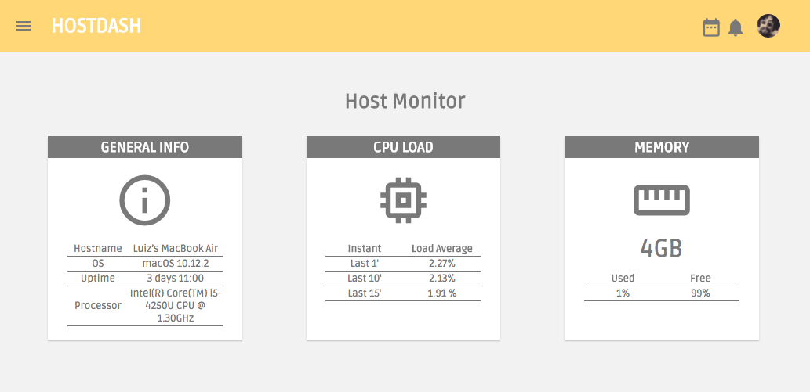
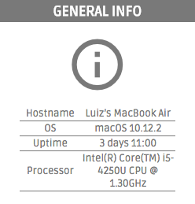
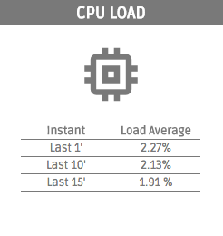

# Host Monitor

## DESCRIÇÃO
---

O seguinte desafio está relacionado à página Web da Figura 1, no qual os recursos necessários para a página serão disponibilizados no arquivo [code.zip](https://github.com/ifpb/dw/blob/master/assessment/prova-php/code.zip).

*Figura 1 - Layout da página*



Resumidamente o layout é dividido em duas áreas principais, o cabeçalho e a área principal de conteúdo. Cada uma dessas áreas apresenta itens com aparências específicas, que devem ser preservados o mais próximo possível do comportamento  estrutural e do estilo apresentado na *Figura 1*.

Para facilitar esse processo, cada questão abordará um item específico, no qual seu conteúdo será previamente disponibilizado por meio dos arquivos obtidos, que já incluem o HTML, o CSS e o JS necessário.

Por exemplo, uma das questões solicitará a coleta de informações de um Host para ser exibido em um painel, utilizando dados por meio de uma API. Como ponto de partida, os arquivos obtidos já disponibilizam a estrutura, o estilo e o script dos paineis que serão alimentados com dados advindos de rotas pré-definidas. Então, através da rota `v1/stats.php?info=overview` será executado alguns comandos que coletarão no servidor Monitor API alguns dados, como **hostname** e **uptime**, para se transformar no JSON da resposta da rota.

Para realização do desafio considere o cenário da *Figura 2*, no qual qualquer computador pode acessar as rotas do servidor Monitor API.

*Figura 2 - Cenário de consumo do Monitor API Server*


<!-- Tal serviço pode ser bastante útil para atividades de monitoramento, pois evita o uso de sistemas mais complexos de monitoramente, e ao mesmo tempo evita o uso excessivo manual de comandos no terminal. -->

A seguir será detalhados os componentes da aplicação.

## COMPONENTES
---

No Layout da *Figura 1* é possível identificar que existem os painéis de informações do Host selecionado, apresentado através dos recortes das *Figura 3* até a *Figura 5*. Todas as informações necessárias para a construção dessas ilustrações estarão disponibilizadas a seguir. Então, através do código obtido alimente os seguintes componentes:

**COMPONENTE 1 -**  O Painel de informações do host conforme a *Figura 3*.

*Figura 3 - Painel de informações do host.*



As rotas usadas para a construção desse painel são o `v1/stats.php?info=overview` e o `v1/stats.php?info=cpuName`.

A rota `v1/stats.php?info=overview` deve retorna o JSON:

```
{
  operatingSystem: "Ubuntu 16.04.2 LTS",
  hostname: "ubuntu-xenial",
  username: "www-data",
  uptime: "1 hour, 9 minutes"
}
```

O comando utilizado para obter os dados pode ser esses:

```
$ lsb_release -d
Description:    Ubuntu 14.04.5 LTS

$ hostname
vagrant-ubuntu-trusty-64

$ whoami
www-data

$ uptime -p
up 15 hours, 9 minutes
```

Já a rota `v1/stats.php?info=cpuName` deve retorna o JSON:

```
{
  cpu: "Intel(R) Core(TM) i5-4250U CPU @ 1.30GHz"
}
```

O comando utilizado para obter os dados pode ser esse:

```
$ cat /proc/cpuinfo  | grep 'name'
model name      : Intel(R) Core(TM) i5-4250U CPU @ 1.30GHz
```

**COMPONENTE 2 -**  O Painel sobre a carga da CPU conforme a *Figura 4*.

*Figura 4 - Painel sobre a carga da CPU.*



Para alimentar o painel é necessário utilizar a rota  `v1/stats.php?info=cpuStatus`, que deve retornar o JSON:

```
{
  cpuLast: {
    last1: 0,
    last10: 0,
    last15: 0
  }
}
```

O comando utilizado para obter os dados pode ser o `top`:

```
$ top -b -n 1 | head -n 3
top - 22:33:37 up 15:11,  1 user,  load average: 0.00, 0.01, 0.05
Tasks:  86 total,   1 running,  85 sleeping,   0 stopped,   0 zombie
%Cpu(s):  0.2 us,  0.1 sy,  0.0 ni, 99.6 id,  0.0 wa,  0.0 hi,  0.0 si,  0.0 st
```

**COMPONENTE 3 -**  O Painel sobre a carga da memória conforme a *Figura 5*.

*Figura 5 - Painel sobre a carga da memória.*


Para a construção desse painel é necessário utilizar a rota `v1/stats.php?info=memory`, que deve retornar o JSON:

```
{
  memoryUsageUsed: 7.7,
  memoryUsageUnused: 92.3
}
```

O comando utilizado para obter os dados pode ser o `free`:

```
$ free
             total       used       free     shared    buffers     cached
Mem:        501692     467344      34348      19144      19348     264072
-/+ buffers/cache:     183924     317768
Swap:            0          0          0
```

> Alternativa de resposta: [code-response/](code-response/)

<!-- http://blacktie.co/2014/07/dashgum-free-dashboard/ -->
<!-- http://linuxdash.afaqtariq.com/#/system-status -->