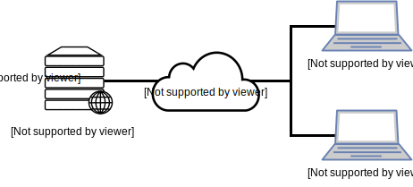

# Monitoramento do ISC DHCP Server

## DESCRIÇÃO
---

O objetivo do presente desafio consiste em criar um monitoramento do serviço DHCP oferecido pelo pacote [isc-dhcp-server](https://www.isc.org/downloads/dhcp/), semelhante ao projeto *open source* [Akkadius/glass-isc-dhcp](https://github.com/Akkadius/glass-isc-dhcp). A Figura 1 ilustra o resultado final do desafio.

*Figura 1 - Layout da aplicação de monitoramento.*<br>


A princípio já foi disponibilizado o front-end da aplicação Web no arquivo [code.zip](code.zip), contudo o back-end ainda não está implemento dinamicamente. Além disso, é disponibilizado um ambiente virtualizado, ilustrado na Figura 2, por meio do arquivo `Vagrantfile`.

*Figura 2 - Ambiente virtualizado do code.zip.*<br>


Lembrando que para disponibilizar o ambiente virtualizado basta executar o comando:

```
$ vagrant up
```

Esse comando permitierá acessar o front-end por meio de [http://localhost:8080/public/index.html](http://localhost:8080/public/index.html), enquanto o comando para acessar o servidor descrito no `Vagrantfile` é:

```
$ vagrant ssh dhcpserver
```

Por fim, é importante observar que do total de componentes será exigido a entrega de no mínimo 2 componentes.

## COMPONENTES
---

**COMPONENTE 1 -** Crie o painel de `cards`, exibido na Figura 4, gerando o JSON dinamicamente por meio do arquivo `api/cards.php`.

*Figura 4 - Painel Top Stats.*<br>


Ao acessar a URL [localhost:8080/api/cards.php](localhost:8080/api/cards.php) a resposta deve possuir o padrão deste JSON:

```json
[
  {
    "icon": "alert-circle",
    "bg": "bg-danger",
    "name": "Leases Per Second / Minute",
    "value": "0.005/0.28"
  },
  {
    "icon": "pie-chart",
    "bg": "bg-info",
    "name": "Total Leases",
    "value": 1
  },
  {
    "icon": "cpu",
    "bg": "bg-primary",
    "name": "CPU",
    "value": 3.7
  },
  {
    "icon": "server",
    "bg": "bg-success",
    "name": "SERVER",
    "value": "dhcpserver "
  }
]
```

A obtenção dos valores de cada card pode ser coletada pelos comandos:

| Card | Comando |
|-|-|
| Server | `hostname` |
| CPU | `top -b n1 | head -n 3 | tail -n 1` |
| Total Leases | `dhcp-lease-list` |
| Leases Per Second / Minute | `dhcp-lease-list --parsable --all` |

**Dica:** a seguir serão descritas algumas sugestões de como extrair os valores dos comandos.

O resultado do comando `hostname` será usado em sua integra:

```
$ hostname
dhcpserver
```

No comando `top -b n1 | head -n 3 | tail -n 1` pode-se obter o valor da CPU livre por meio do Regexp `/, ([\d\.]*) id,/`, ou seja, `100% - 96.3% (idle)` será igual a `3.7%`:

```
$ top -b n1 | head -n 3 | tail -n 1
%Cpu(s):  2.9 us,  0.7 sy,  0.1 ni, 96.3 id,  0.2 wa,  0.0 hi,  0.1 si,  0.0 st
```

Já o comando `dhcp-lease-list` pode contabilizar a quantia de empréstimos pela contagem de endereços MAC via a Regexp `/..(:..){5}/`, ou seja, como só possui o MAC `08:00:27:81:9c:76`, logo o valor de empréstimo é `1`:

```
$ dhcp-lease-list
Reading leases from /var/lib/dhcp/dhcpd.leases
MAC                IP              hostname       valid until         manufacturer        
===============================================================================================
08:00:27:81:9c:76  192.168.1.10    dhcpclient1    2019-02-14 16:58:54 
```

Por fim, o valor da razão entre o total de empréstimos de IP e do tempo total será calculado respectivamente pelo empréstimos, coletados no comando anterior, e o tempo total dos empréstimos, usando o comando `dhcp-lease-list --parsable --all`. Este último valor pode ser extraído usando a diferença do primeiro tempo até o último, ou seja, do valor do primeiro `BEGIN` até o último `END`. Por exemplo, a diferença de tempo do comando a seguir seria entre 2019-02-14 16:28:55 e 2019-02-14 17:03:54.

```
$ dhcp-lease-list --parsable --all
MAC 08:00:27:81:9c:76 IP 192.168.1.10 HOSTNAME dhcpclient1 BEGIN 2019-02-14 16:28:55 END 2019-02-14 16:38:55 MANUFACTURER 
MAC 08:00:27:81:9c:76 IP 192.168.1.10 HOSTNAME dhcpclient1 BEGIN 2019-02-14 16:33:56 END 2019-02-14 16:43:56 MANUFACTURER 
MAC 08:00:27:81:9c:76 IP 192.168.1.10 HOSTNAME dhcpclient1 BEGIN 2019-02-14 16:38:55 END 2019-02-14 16:48:55 MANUFACTURER 
MAC 08:00:27:81:9c:76 IP 192.168.1.10 HOSTNAME dhcpclient1 BEGIN 2019-02-14 16:43:55 END 2019-02-14 16:53:55 MANUFACTURER 
MAC 08:00:27:81:9c:76 IP 192.168.1.10 HOSTNAME dhcpclient1 BEGIN 2019-02-14 16:48:54 END 2019-02-14 16:58:54 MANUFACTURER 
MAC 08:00:27:81:9c:76 IP 192.168.1.10 HOSTNAME dhcpclient1 BEGIN 2019-02-14 16:53:54 END 2019-02-14 17:03:54 MANUFACTURER
```

Contudo, a diferença em segundo dessas duas datas, que originalmente estão em String, pode ser realizado usando o seguinte código:

```php
$start_date = strtotime($start);
$end_date = strtotime($end);
$diff = abs($end_date - $start_date);
```

Enquanto que as variávies `$start` e `$end` podem ser coletadas respectivamente por meio das Regexp `/BEGIN (\d{4}-\d{2}-\d{2} \d{2}:\d{2}:\d{2})/` e `/END (\d{4}-\d{2}-\d{2} \d{2}:\d{2}:\d{2})/`.

**COMPONENTE 2 -** Crie o conteúdo do Painel `Subnets`, exibido na Figura 4, gerando o JSON dinamicamente por meio do arquivo `api/subnets.php`.

*Figura 4 - Painel de Subnets.*<br>


O conteúdo do JSON deve ser a saída do comando:

```
$ dhcpd-pools -l /var/lib/dhcp/dhcpd.leases -c /etc/dhcp/dhcpd.conf -f J
{
   "active_leases": [
         { "ip":"192.168.1.10", "macaddress":"08:00:27:81:9c:76" }
   ],
   "subnets": [
         { "location":"office", "range":"10.0.0.1 - 10.0.0.126", "defined":126, "used":0, "touched":0, "free":126 },
   ...
}
```

Ao acessar a URL [localhost:8080/api/subnets.php](localhost:8080/api/subnets.php) a resposta deve possuir o padrão deste JSON:

```json
{
   "active_leases": [
         { "ip":"192.168.1.10", "macaddress":"08:00:27:81:9c:76" }
   ],
   "subnets": [
         { "location":"office", "range":"10.0.0.1 - 10.0.0.126", "defined":126, "used":0, "touched":0, "free":126 },
         { "location":"office", "range":"10.0.0.129 - 10.0.0.254", "defined":126, "used":0, "touched":0, "free":126 },
         { "location":"All networks", "range":"192.168.1.10 - 192.168.1.100", "defined":91, "used":1, "touched":0, "free":90 },
         { "location":"All networks", "range":"192.168.2.10 - 192.168.2.100", "defined":91, "used":0, "touched":0, "free":91 }
   ],
   "shared-networks": [
         { "location":"office", "defined":252, "used":0, "touched":0, "free":252 }
   ],
   "summary": {
         "location":"All networks",
         "defined":434,
         "used":1,
         "touched":0,
         "free":433
   }
}
```

**COMPONENTE 3 -** Crie o conteúdo do Painel `Leases`, exibido na Figura 5, gerando o JSON dinamicamente por meio do arquivo `api/leases.php`.

*Figura 5 - Painel de Leases.*<br>


Ao acessar a URL [localhost:8080/api/leases.php](localhost:8080/api/leases.php) a resposta deve possuir o padrão deste JSON:

```json
[
  {
    "mac": "08:00:27:81:9c:76",
    "ip": "192.168.1.10",
    "hostname": "dhcpclient1",
    "valid": "2019-02-14 16:38:55",
    "manufacturer": ""
  },
  {
    "mac": "08:00:27:81:9c:76",
    "ip": "192.168.1.10",
    "hostname": "dhcpclient1",
    "valid": "2019-02-14 16:43:56",
    "manufacturer": ""
  },
  {
    "mac": "08:00:27:81:9c:76",
    "ip": "192.168.1.10",
    "hostname": "dhcpclient1",
    "valid": "2019-02-14 16:48:55",
    "manufacturer": ""
  },
  {
    "mac": "08:00:27:81:9c:76",
    "ip": "192.168.1.10",
    "hostname": "dhcpclient1",
    "valid": "2019-02-14 16:53:55",
    "manufacturer": ""
  },
  {
    "mac": "08:00:27:81:9c:76",
    "ip": "192.168.1.10",
    "hostname": "dhcpclient1",
    "valid": "2019-02-14 16:58:54",
    "manufacturer": ""
  },
  {
    "mac": "08:00:27:81:9c:76",
    "ip": "192.168.1.10",
    "hostname": "dhcpclient1",
    "valid": "2019-02-14 17:03:54",
    "manufacturer": ""
  }
]
```

Enquanto que o conteúdo do JSON deve ser obtido por meio da saída do comando:

```
$ dhcp-lease-list --parsable --all
MAC 08:00:27:81:9c:76 IP 192.168.1.10 HOSTNAME dhcpclient1 BEGIN 2019-02-14 16:28:55 END 2019-02-14 16:38:55 MANUFACTURER 
MAC 08:00:27:81:9c:76 IP 192.168.1.10 HOSTNAME dhcpclient1 BEGIN 2019-02-14 16:33:56 END 2019-02-14 16:43:56 MANUFACTURER 
MAC 08:00:27:81:9c:76 IP 192.168.1.10 HOSTNAME dhcpclient1 BEGIN 2019-02-14 16:38:55 END 2019-02-14 16:48:55 MANUFACTURER 
MAC 08:00:27:81:9c:76 IP 192.168.1.10 HOSTNAME dhcpclient1 BEGIN 2019-02-14 16:43:55 END 2019-02-14 16:53:55 MANUFACTURER 
MAC 08:00:27:81:9c:76 IP 192.168.1.10 HOSTNAME dhcpclient1 BEGIN 2019-02-14 16:48:54 END 2019-02-14 16:58:54 MANUFACTURER 
MAC 08:00:27:81:9c:76 IP 192.168.1.10 HOSTNAME dhcpclient1 BEGIN 2019-02-14 16:53:54 END 2019-02-14 17:03:54 MANUFACTURER 
```

**Dica:** Uma forma de obter os dados de cada empréstimo seria usando a Regexp `/MAC (\S*) IP (\S*) HOSTNAME (\S*) BEGIN (\d{4}-\d{2}-\d{2} \d{2}:\d{2}:\d{2}) END (\d{4}-\d{2}-\d{2} \d{2}:\d{2}:\d{2}) MANUFACTURER (.*)?/` de modo global.

<br>
<br>
<br>

> [Alternativa de resposta](code-response.zip)