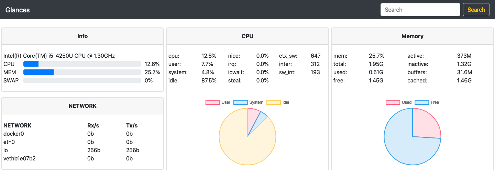
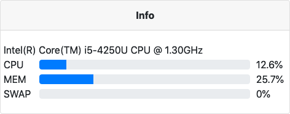
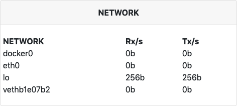
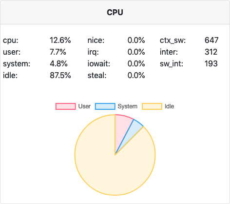
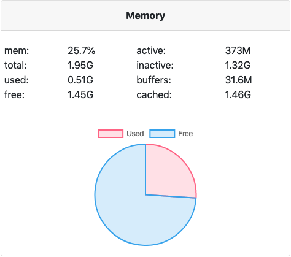

# Interface Web para o nicolargo/glances

## DESCRIÇÃO

---

Baseado no desafio Front-end estático do [nicolargo/glances](https://github.com/nicolargo/glances) foi idealizado a criação da mesma página dinamicamente usando Javascript para gerar a interface semelhante ao da _Figura 1_.

_Figura 1 - Layout Web do [nicolargo/glances](https://github.com/nicolargo/glances)_

O desafio utiliza o projeto [code.zip](code.zip), nele existe a pasta `data` que possui o JSON contendo as informações de um servidor, e para ser considerado completo é necessário entregar no mínimo **dois componentes**.

## COMPONENTES

---

**COMPONENTE 1 -** Crie um painel de informações básicas conforme a _Figura 2_ usando `data/info.json`.

_Figura 2 - Informações bases._ 

**COMPONENTE 2 -** Crie um painel de informações da rede conforme a _Figura 3_ usando `data/network.json`.

_Figura 3 - Informações sobre a rede._ 

**COMPONENTE 3 -** Crie um painel de informações da CPU conforme a _Figura 3_ usando `data/cpu.json`.

_Figura 4 - Informações da CPU._ 

**COMPONENTE 4 -** Crie um painel de informações da memória conforme a _Figura 5_ usando `data/memory.json`.

_Figura 5 - Informações sobre a memória._ 

