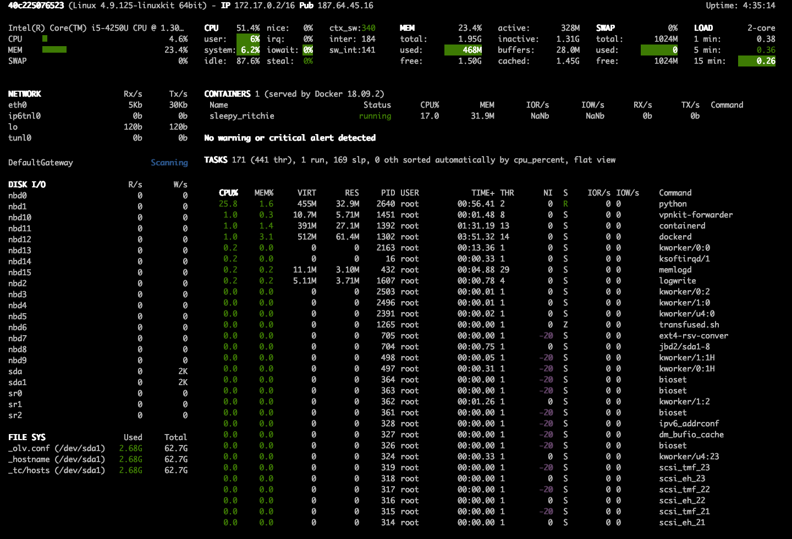
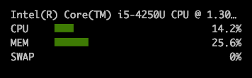
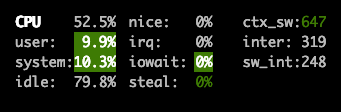
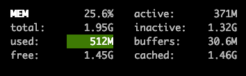
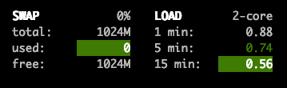
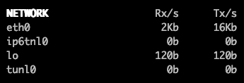
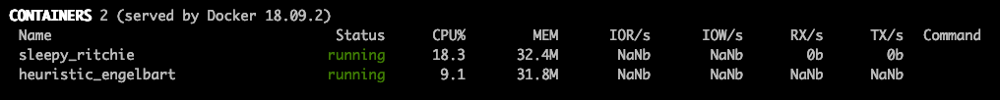
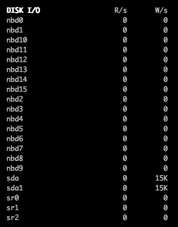
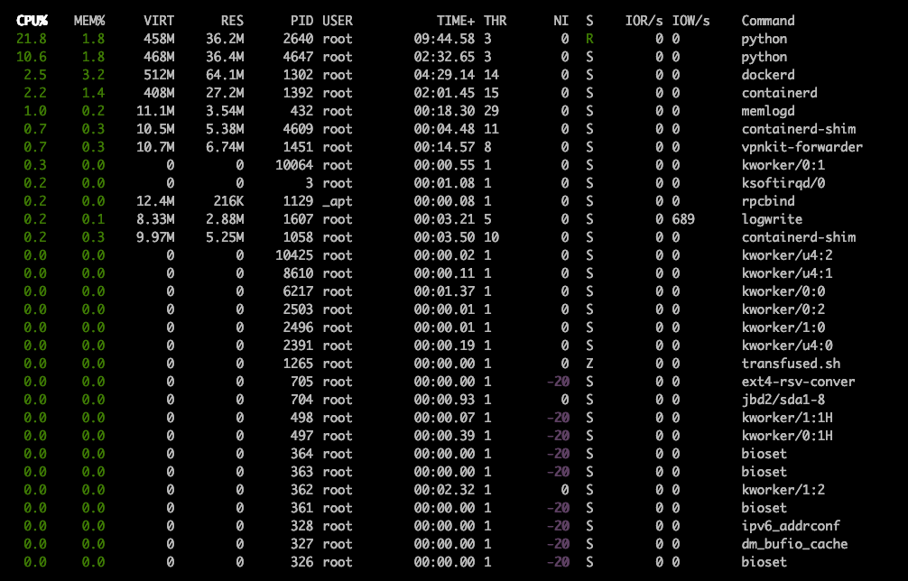

# Interface Web para o nicolargo/glances

## DESCRIÇÃO

---

O projeto _open source_ [nicolargo/glances](https://github.com/nicolargo/glances) tem a finalidade criar um dashboard para monitorar informações em modo texto. Ao executar o sistema via os comandos a seguir:

```
$ docker pull nicolargo/glances
$ docker run -d --restart="always" -p 61208-61209:61208-61209 -e GLANCES_OPT="-w" -v /var/run/docker.sock:/var/run/docker.sock:ro --pid host docker.io/nicolargo/glances
```

Percebe-se que é possível acessá-lo via o endereço [http://localhost:61208](http://localhost:61208) gerando um resultado semelhante ao da _Figura 1_.

_Figura 1 - Layout Web do [nicolargo/glances](https://github.com/nicolargo/glances)_


Usando este outro comando o sistema também se torna acessível via terminal:

```
$ docker pull nicolargo/glances
$ docker run --rm -v /var/run/docker.sock:/var/run/docker.sock:ro --pid host --network host -it docker.io/nicolargo/glances
```

Então, pensando em propor uma contribuição que exibisse essas informações usando um layout com a aparência do [Bootstrap](https://getbootstrap.com), foi que o presente desafio propôs a escolha de algumas informações que serão descritos a seguir por meio dos componentes.

Para o desafio ser considerado complete é necessário entregar no mínimo **quatro componentes**.

## COMPONENTES

---

**COMPONENTE 1 -** Crie um painel de informações básicas conforme a _Figura 2_.

_Figura 2 - Informações bases._<br>


Para auxiliar na construção deste componente é possível utilizar o seguinte conteúdo:

```
Intel(R) Core(TM) i5-4250U CPU @ 1.30GHz - 1.90/1.30GHz
CPU  [|||||||                                                   12.6%]
MEM  [|||||||||||||||                                           25.7%]
SWAP [                                                           0.0%]
```

**COMPONENTE 2 -** Crie um painel de informações da CPU conforme a _Figura 3_.

_Figura 3 - Informações sobre a CPU._<br>


Para auxiliar na construção deste componente é possível utilizar o seguinte conteúdo:

```
CPU      12.6%  nice:     0.0%  ctx_sw:   647
user:     7.7%  irq:      0.0%  inter:    312
system:   4.8%  iowait:   0.0%  sw_int:   193
idle:    87.5%  steal:    0.0%
```

**COMPONENTE 3 -** Crie um painel de informações da memória conforme a _Figura 3_.

_Figura 4 - Informações da memória._<br>


Para auxiliar na construção deste componente é possível utilizar o seguinte conteúdo:

```
MEM     25.7%  active:     373M
total:  1.95G  inactive:  1.32G
used:    514M  buffers:   31.6M
free:   1.45G  cached:    1.46G
```

**COMPONENTE 4 -** Crie um painel de informações do SWAP e da carga média de processamento conforme a _Figura 5_.

_Figura 5 - Informações sobre o SWAP e da carga média de processamento._<br>


Para auxiliar na construção deste componente é possível utilizar o seguinte conteúdo:

```
SWAP      0.0%         LOAD    2-core
total:   1024M         1 min:    0.60
used:        0         5 min:    0.81
free:    1024M         15 min:   0.70
```

**COMPONENTE 5 -** Crie um painel de informações sobre o uso da rede conforme a _Figura 6_.

_Figura 6 - Informações sobre o uso da rede._<br>


Para auxiliar na construção deste componente é possível utilizar o seguinte conteúdo:

```
NETWORK                  Rx/s   Tx/s
docker0                    0b     0b
eth0                       0b     0b
lo                       256b   256b
vethb1e07b2                0b     0b
```

**COMPONENTE 6 -** Crie um painel de informações sobre os containers docker conforme a _Figura 7_.

_Figura 7 - Informações sobre os containers docker._<br>


Para auxiliar na construção deste componente é possível utilizar o seguinte conteúdo:

```
 CONTAINERS 2 (served by Docker 18.09.2)

 Name                   Status  CPU%    MEM   /MAX  IOR/s  IOW/s   Rx/s   Tx/s Command
 heuristic_engelbart   running  27.4  34.6M  1.95G      _      _      _      _ _
 sleepy_ritchie        running   0.3  33.7M  1.95G      _      _     0b     0b _
```

**COMPONENTE 7 -** Crie um painel de informações sobre o uso de disco conforme a _Figura 8_.

_Figura 8 - Informações sobre o uso de disco._<br>


Para auxiliar na construção deste componente é possível utilizar o seguinte conteúdo:

```
DISK I/O                  R/s    W/s
nbd0                        0      0
nbd1                        0      0
nbd2                        0      0
nbd3                        0      0
nbd4                        0      0
nbd5                        0      0
nbd6                        0      0
nbd7                        0      0
nbd8                        0      0
nbd9                        0      0
nbd10                       0      0
nbd11                       0      0
nbd12                       0      0
nbd13                       0      0
nbd14                       0      0
nbd15                       0      0
sda                         0      0
sda1                        0      0
sr0                         0      0
sr1                         0      0
sr2                         0      0
```

**COMPONENTE 8 -** Crie um painel de informações do uso da CPU conforme a _Figura 9_.

_Figura 9 - Informações do uso da CPU._


Para auxiliar na construção deste componente é possível utilizar o seguinte conteúdo:

```
CPU%   MEM%  VIRT  RES     PID USER          TIME+ THR  NI S  R/s W/s  Command
40.2   1.9   460M  37.6M  2640 root          12:35 3     0 S    0 0    python -m glances -C /glances/conf/glances.conf -w
13.3   2.0   471M  39.2M  4647 root           4:15 3     0 R    0 0    python -m glances -C /glances/conf/glances.conf
2.3    3.3   512M  65.4M  1302 root           4:36 14    0 S    ? ?    /usr/local/bin/dockerd -H unix:///var/run/docker.sock --config-file /run/config/docker/daemon.
2.0    1.4   408M  27.0M  1392 root           2:16 15    0 S    ? ?    containerd --config /var/run/docker/containerd/containerd.toml --log-level debug
1.0    1.5   43.7M 30.0M   957 root           0:12 23    0 S    ? ?    /usr/bin/containerd
1.0    0.3   10.7M 6.74M  1451 root           0:21 8     0 S    0 0    //vpnkit-forwarder -vsockPort 62373
1.0    0.2   11.1M 3.76M   432 root           0:28 29    0 S    ? ?    /usr/bin/memlogd -fd-log 3 -fd-query 4 -max-lines 5000 -max-line-len 1024
0.7    0.3   10.5M 5.36M  4609 root           0:07 11    0 S    ? ?    containerd-shim -namespace moby -workdir /var/lib/docker/containerd/daemon/io.containerd.runti
0.7    0.3   9.97M 5.35M  1490 root           0:01 12    0 S    ? ?    containerd-shim -namespace services.linuxkit -workdir /var/lib/containerd/io.containerd.runtim
0.3    0.1   9.95M 2.85M  1607 root           0:04 5     0 S    0 1K   /usr/bin/logwrite -max-log-files 8 -max-log-size 10485760
0.3    0.0   0     0     15262 root           0:00 1     0 S    ? ?    [kworker/0:2]
0.0    5.2   108M  105M   1184 root           0:00 1     0 S    ? ?    rpc.statd
0.0    0.8   22.3M 15.9M  1243 root           0:00 9     0 S    ? ?    /usr/bin/lifecycle-server
0.0    0.6   17.2M 12.0M  1032 root           0:00 7     0 S    ? ?    /usr/local/bin/diagnosticsd -port 62374
0.0    0.3   10.0M 5.84M  1544 root           0:01 10    0 S    ? ?    containerd-shim -namespace services.linuxkit -workdir /var/lib/containerd/io.containerd.runtim
0.0    0.3   8.59M 5.72M  1169 root           0:01 12    0 S    ? ?    containerd-shim -namespace services.linuxkit -workdir /var/lib/containerd/io.containerd.runtim
0.0    0.3   8.59M 5.68M  1115 root           0:01 10    0 S    ? ?    containerd-shim -namespace services.linuxkit -workdir /var/lib/containerd/io.containerd.runtim
0.0    0.3   8.59M 5.57M  1432 root           0:01 10    0 S    ? ?    containerd-shim -namespace services.linuxkit -workdir /var/lib/containerd/io.containerd.runtim
0.0    0.3   8.23M 5.54M  1397 root           0:00 5     0 S    ? ?    /usr/bin/trim-after-delete -- /sbin/fstrim /var/lib/docker
0.0    0.3   9.97M 5.50M   971 root           0:01 10    0 S    ? ?    containerd-shim -namespace services.linuxkit -workdir /var/lib/containerd/io.containerd.runtim
0.0    0.3   8.59M 5.49M  1217 root           0:01 12    0 S    ? ?    containerd-shim -namespace services.linuxkit -workdir /var/lib/containerd/io.containerd.runtim
0.0    0.3   8.59M 5.48M  1371 root           0:01 10    0 S    ? ?    containerd-shim -namespace services.linuxkit -workdir /var/lib/containerd/io.containerd.runtim
0.0    0.3   9.97M 5.34M  1058 root           0:04 10    0 S    ? ?    containerd-shim -namespace services.linuxkit -workdir /var/lib/containerd/io.containerd.runtim
0.0    0.3   8.59M 5.31M  1014 root           0:01 12    0 S    ? ?    containerd-shim -namespace services.linuxkit -workdir /var/lib/containerd/io.containerd.runtim
0.0    0.3   8.59M 5.25M  1321 root           0:01 10    0 S    ? ?    containerd-shim -namespace services.linuxkit -workdir /var/lib/containerd/io.containerd.runtim
0.0    0.2   10.5M 4.57M  2582 root           0:00 11    0 S    ? ?    containerd-shim -namespace moby -workdir /var/lib/docker/containerd/daemon/io.containerd.runti
0.0    0.1   5.37M 2.94M  2535 root           0:00 8     0 S    ? ?    /usr/bin/vpnkit-expose-port -proto tcp -host-ip 0.0.0.0 -host-port 61209 -container-ip 172.17.
0.0    0.1   5.74M 2.46M  1227 root           0:00 4     0 S    ? ?    /usr/bin/logwrite -n lifecycle-server /usr/bin/lifecycle-server
0.0    0.1   5.28M 2.33M  2574 root           0:00 7     0 S    ? ?    /usr/bin/vpnkit-expose-port -proto tcp -host-ip 0.0.0.0 -host-port 61208 -container-ip 172.17.
0.0    0.1   3.90M 2.31M  1141 root           0:01 4     0 S    ? ?    /usr/bin/host-timesync-daemon -port 0xf3a4
0.0    0.1   12.2M 2.01M  1508 root           0:03 20    0 S    0 0    //vsudd -inport 2376:unix:/var/run/docker.sock
0.0    0.1   3.67M 1.88M  1188 root           0:00 4     0 S    ? ?    /usr/bin/kmsg
0.0    0.0   1.55M 996K   1225 root           0:00 1     0 S    ? ?    /bin/sh -x /usr/bin/start-docker.sh
```

<br>
<br>

> [Alternativa de respostas](code-response/)
