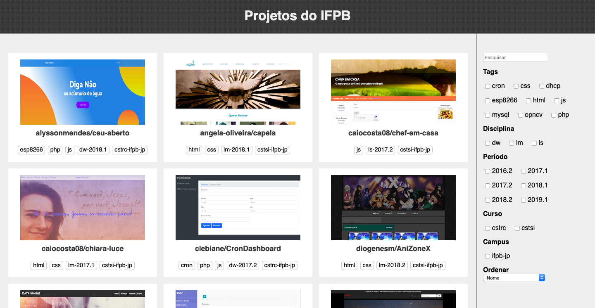
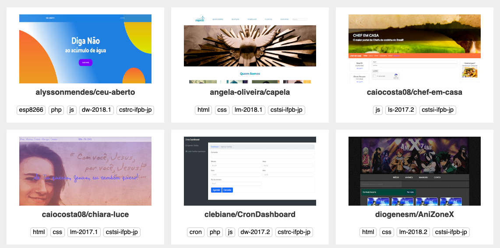
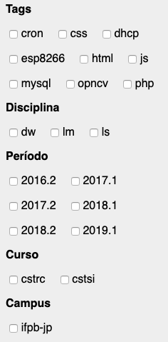

# Interface para o portal ifpb/projects

## DESCRIÇÃO

---

O portal [ifpb/projects](https://github.com/ifpb/projects) está precisando de alguns ajustes para melhorar sua experiência de uso. Dentre as necessidades de mudança a realização de filtros é uma opção que poderia facilitar o acesso de projetos específicos.

Então o presente desafio propõe a construção da Interface Web semelhante ao da _Figura 1_.

_Figura 1 - Proposta de Layout Web para [ifpb/projects](https://github.com/ifpb/projects)_

O desafio utiliza o projeto [code.zip](code.zip), nele existe a pasta `data` que possui o JSON contendo as informações dos projetos, e para ser considerado completo é necessário entregar no mínimo **dois componentes**.

## COMPONENTES

---

**COMPONENTE 1 -** Crie o painel dinâmico de projetos conforme a _Figura 2_.

_Figura 2 - Exibição dos projetos_ 

**COMPONENTE 2 -** Crie o painel dinâmico de filtro conforme a _Figura 3_.

_Figura 3 - Visão do filtro de projetos_ 

**COMPONENTE 3 -** Crie as ações do painel de filtro conforme a animação da _Figura 4_.

_Figura 4 - Ação do filtro de projetos_ 

<video autoplay loop controls>
  <source src="assets/component-3.webm" type="video/webm">
  <source src="assets/component-3.mov" type="video/mov">
</video>
