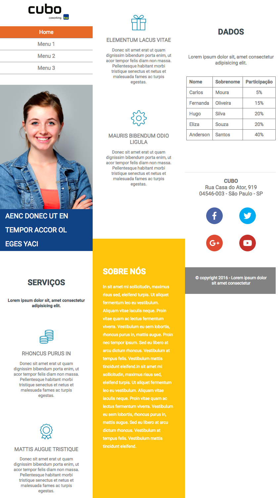
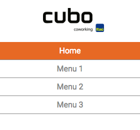
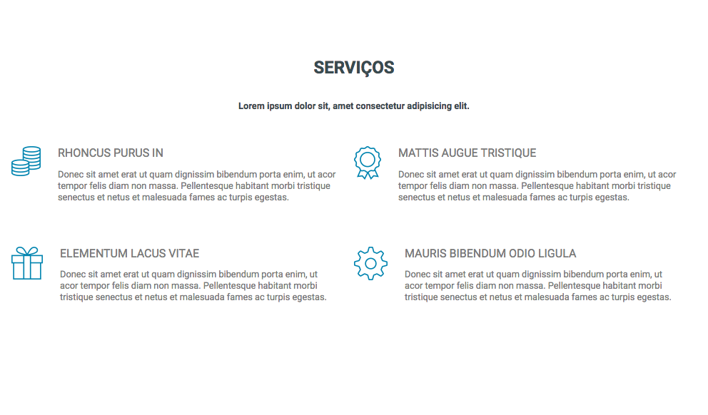
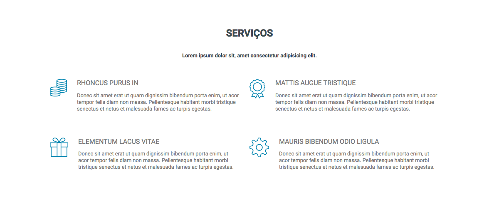
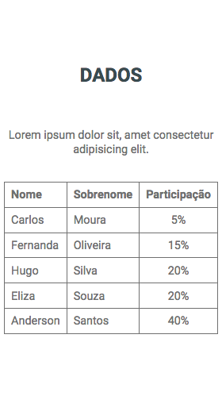
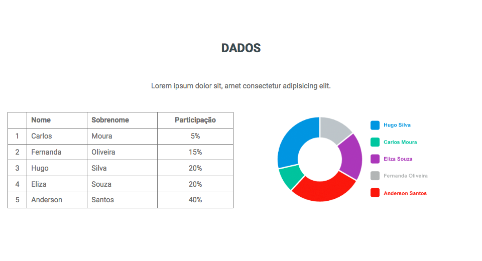
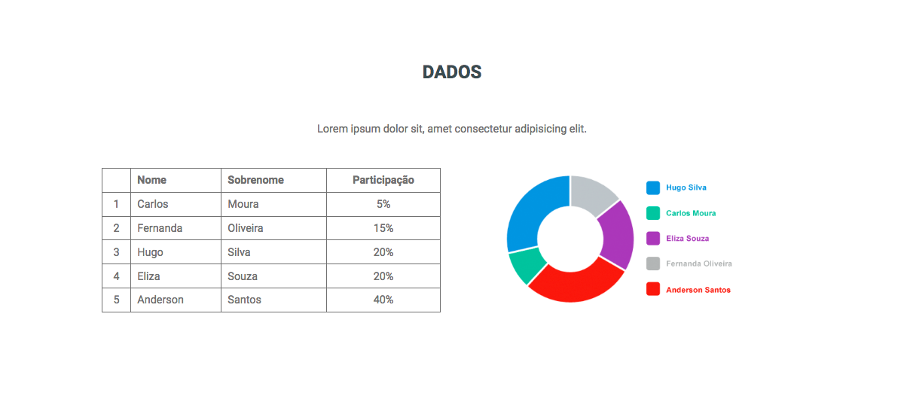

# Desafio do Cubo Network

## Descrição
---

Devido ao sucesso do primeiro desafio do [Cubo Network](https://github.com/cubonetwork/frontend-challenge) a próxima etapa da seleção consiste em criar uma interface Front-end responsivo.

Para auxiliar esta etapa foi desenvolvido um desafio que exige a criação de alguns componentes visuais, que serão descritos a seguir usando o layout Mobile First da Figura 1.

*Figura 1 - Layout do site em 280px* 

Esta estrutura básica se encontra no arquivo [site.zip](site.zip), e a ideia do desafio consiste em fazer no mínimo 2 componentes responsivos para resolução superiores.

Os breakpoints necessários para cada componente serão descritos e ilustrados a seguir.

## Componentes
---

**COMPONENTE 1 -** Crie a responsividade do cabeçalho do site, contudo, considere que essa região possui quatro breakpoints em 280px, 400px, 600px e 960px, respectivamente ilustrado na Figura 2(a), Figura 2(b), Figura 2(c) e Figura 2(d). Observação, o breakpoint de 960px está sendo visualizando em 1200px na Figura 2(d), e consiste em limitar a expansão do cabeçalho definindo uma largura fixa de 960px.

*Figura 2 - Cabeçalho* 
*(a) 280px* 
 
*(b) 400px* 
 
*(c) 600px* 
 
*(d) 1200px* 
 

**COMPONENTE 2 -** Crie a responsividade do banner do site, contudo, considere que essa região possui três breakpoints em 280px, 400px e 600px, respectivamente ilustrado na Figura 3(a), Figura 3(b) e Figura 3(c). Observação, o breakpoint de 960px  limita a expansão do banner definindo uma largura fixa de 960px.

*Figura 3 - Banner* 
*(a) 280px* 
 
*(b) 580px* 
 
*(c) 960px* 
 

**COMPONENTE 3 -** Crie a responsividade do painel de serviços do site, contudo, considere que essa região possui dois breakpoints em 280px e 960px, respectivamente ilustrado na Figura 4(a) e Figura 4(b). Observação, o breakpoint de 960px está sendo visualizando em 1200px na Figura 4(c), e consiste em limitar a expansão do painel definindo uma largura fixa de 960px.

*Figura 4 - Serviços* 
*(a) 280px* 
 
*(b) 960px* 
 
*(c) 1200px* 
 

**COMPONENTE 4 -** Crie a responsividade do painel de dados do site, contudo, considere que essa região possui dois breakpoints em 280px e 960px, respectivamente ilustrado na Figura 5(a) e Figura 5(b). Contudo, o breakpoint de 960px limita a expansão do painel definindo uma largura fixa de 960px, visivel na Figura 5 (c) em 1200px.

*Figura 5 - Dados* 
*(a) 280px* 
 
*(b) 960px* 
 
*(c) 1200px* 
 

**COMPONENTE 5 -** Crie a responsividade do rodapé, contudo, considere que essa região possui quatro breakpoints em 280px, 300px, 650px e 960px, respectivamente ilustrado na Figura 6(a), Figura 6(b), Figura 6(c) e Figura 6(d). Observação, o breakpoint de 960px está sendo visualizando em 1200px na Figura 6(c), e consiste em limitar a expansão do rodapé definindo uma largura fixa de 960px.

*Figura 6 - Dados* 
*(a) 280px* 
 
*(b) 300px* 
 
*(c) 650px* 
 
*(d) 1200px* 
 

> [Alternativa de resposta](site-response/)