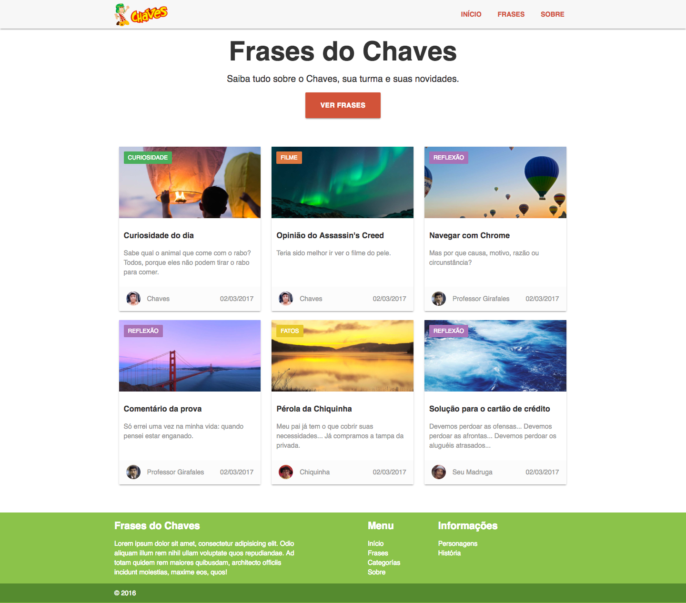
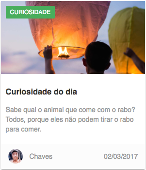
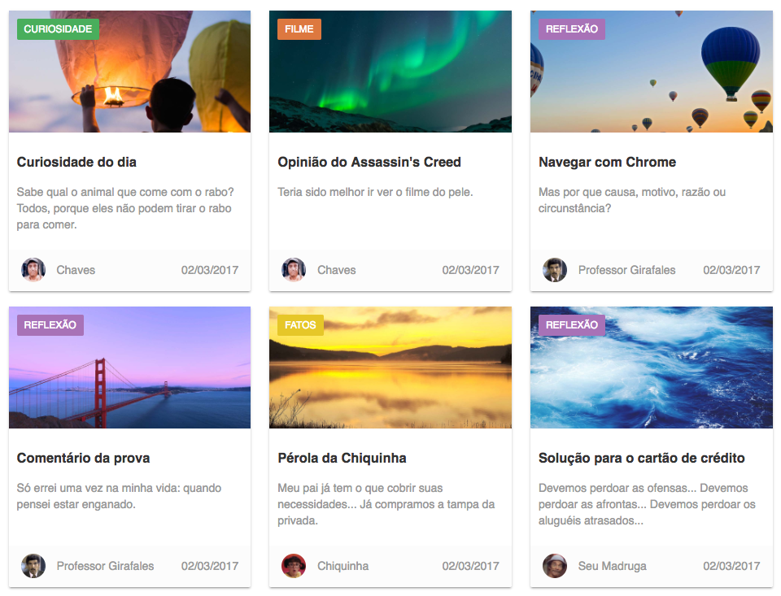

# Portfólio

## DESCRIÇÃO
---

As questões da prova serão relacionadas ao layout da página Web da Figura 1, no qual os recursos necessários para a página serão disponibilizados através do arquivo [code.zip](code.zip).

*Figura 1 - Layout da página*

Resumidamente o layout é dividido em algumas áreas: a barra de navegação, o cabeçalho, a área principal de conteúdo e o rodapé. Cada uma dessas áreas apresenta itens com aparências específicas, que devem ser preservados o mais próximo possível do comportamento  estrutural e do estilo apresentado na Figura 1.

Para facilitar nesse processo, cada questão abordará um item específico, no qual seu conteúdo será previamente disponibilizado por meio dos arquivos baixados. Por exemplo, uma das questões solicitará a criação e estilização da barra de menu, e como ponto de partida, os arquivos baixados já oferecem o conteúdo a ser inserido, como exibido a seguir:

> TODO barra de navegação 
> img/logo-chaves.png 
> Início 
> Frases 
> Sobre 

para que seja utilizado pelo aluno na criação da estrutura do HTML e estilização do CSS da barra de menu.

## QUESTÕES
---

**QUESTÃO 1 -** No Layout da Figura 1 é possível identificar a barra de menu do site. Através dos arquivos obtidos, veja que o layout não apresenta nem HTML e nem CSS da barra, então, crie a aparência da barra de menu conforme a Figura 2 considerando que:

  * O logotipo da página deve ser colocado no ínicio da barra;
  * A lista de menu deve ser alinhada à direita;
  * No menu a cor de texto deve ser `#d25339`, o texto deve estar em caixa alta e negrito, além disso, o link não deve conter sublinhado;
  * Inclua a classe pré-existente box-shadow na barra de menu;
  * Os distanciamentos e aparência entre os elementos devem ser preservados.

*Figura 2 - Barra de menu.*

**QUESTÃO 2 -** Para criação do cabeçalho inicial da página, presente na Figura 3, é necessário:

  * Deixar todos os elementos centralizados;
  * O título deve conter tamanho de `3.5rem` e o subtítulo de `1.2rem`;
  * O botão "Ver frases" possui a altura de `54px`, não deve ser sublinhado, raio da borda de `2px`, espaçamento interna de borda com `0 2rem`, e plano de fundo de `#d25339`;
  * Os distanciamentos e aparência entre os elementos devem ser preservados.

*Figura 3 - Cabeçalho inicial da página.*

**QUESTÃO 3 -** Outra área importante do layout da Figura 1 é a exibição das frases, apresentado através do recorte das Figuras 4 e 5. Todos os textos necessários para essa ilustração estão disponibilizados, então, faça com que os distanciamentos e aparência entre os elementos sejam preservados e construa:

**a.** Uma mensagem conforme a Figura 4, de modo que:

  * A mensagem é definida em um artigo em três regiões: cabeçalho, conteúdo e rodapé;
  * O artigo deve conter a classe box-shadow e tamanho de `345px`;
  * O cabeçalho do artigo deve conter um plano de fundo proposto que se ajuste a largura da imagem;
  * O cabeçalho do artigo deve conter uma indicação de categoria sem sublinhado, recuo interno da borda de `7px 9px 6px`, margem de `10px 0 0 10px`, com negrito e fonte Oxygen;
  * Cada categoria já possui uma lista de cores pré-definidos através de classes no arquivo CSS.
  * No conteúdo do artigo a frase deve possuir cor de texto com `#999`;
  * No rodapé do artigo o recuo interno da borda possui `10px 15px`, o plano de fundo é de `#fcfcfc` e a cor de text é `#999`;
  * A imagem do autor da frase deve possuir raio da borda de `50%`.

*Figura 4 - Exibição de uma mensagem.*

**b.** Uma lista de mensgens em grid conforme a Figura 5, de modo que a largura de cada artigo deve ser de `31%` e margem de `1%`, além disso, sua exibição deve ser feita conforme o grid.

*Figura 5 - Lista de mensagens em grid.*

**QUESTÃO 4 -** Por fim, o Layout da Figura 1 possui na parte inferior o rodapé tal como a Figura 6. Então para sua construção deve-se considerar que:

  * O texto de descrição deve ocupar `40%` de largura, enquanto que a lista de links deve ser de `15%` de largura;
  * O texto de descrição deve possuir uma margin de `15%` em relação a lista de links;
  * Os distanciamentos e aparência entre os elementos devem ser preservados.

*Figura 6 - Roda pé da página.*

> *[Alternativa de resposta](code-response/).*
