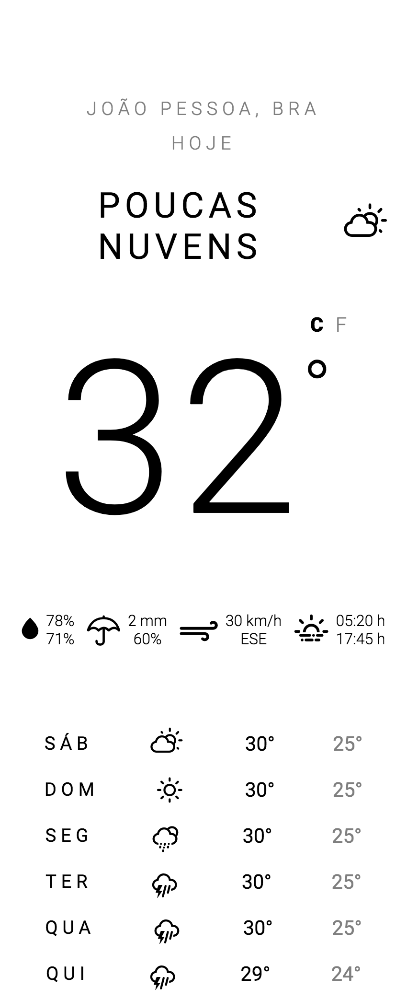
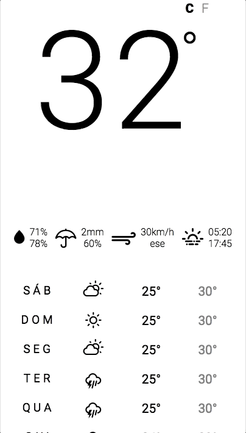

# APLICATIVO DE CLIMA

## DESCRIÇÃO
---

Um grupo de ciclistas estava procurando uma aplicação Web para facilitar o acompanhamento das condições climática de João Pessoa, mas que fosse simples e com a aparência limpa.

Inicialmente um *designer* chegou a criar a página Web da *Figura 1* de modo estático no arquivo [code.zip](code.zip), e estava precisando da ajuda de um programador Javascript para tornar a página dinâmica.

*Figura 1 - Site da previsão do tempo (Versão Mobile)*<br>
<!--  -->


Pensando em facilitar a programação do Javascript o *designer* planejou os seguintes componentes.

## COMPONENTES
---

Crie os componentes dinâmicos da *Figura 1* usando o arquivo [weather-forecast.json](code/data/weather-forecast.json):

**COMPONENTE 1 -**  O cabeçalho, conforme a *Figura 2*.

*Figura 2 - Cabeçalho do site da previsão do tempo.*<br>


**COMPONENTE 2 -** A área de informações extras, conforme a *Figura 3*.

*Figura 3 - Informação extra do site da previsão do tempo.*<br>


**COMPONENTE 3 -** A tabela de previsões dos demais dias, conforme a *Figura 4*.

*Figura 4 - Previsão semanal.*<br>


**COMPONENTE 4 -** Como o grupo de ciclistas às vezes recebe algumas pessoas do exterior, foi solicitado a criação de um seletor de formato de temperatura, como ilustrado na *Figura 5*, que faz a converão entre `Celsius` e `Fahrenheit` de todas as temperaturas da página.

*Figura 5 - Conversor.*<br>


> **Dica**: Para converter as temperaturas use as seguintes fórmulas:

```
C = (F - 32) / 1.8
F = C * 1.8 + 32
```

<br>
<br>

> [Alternativa de resposta](code-response/).
